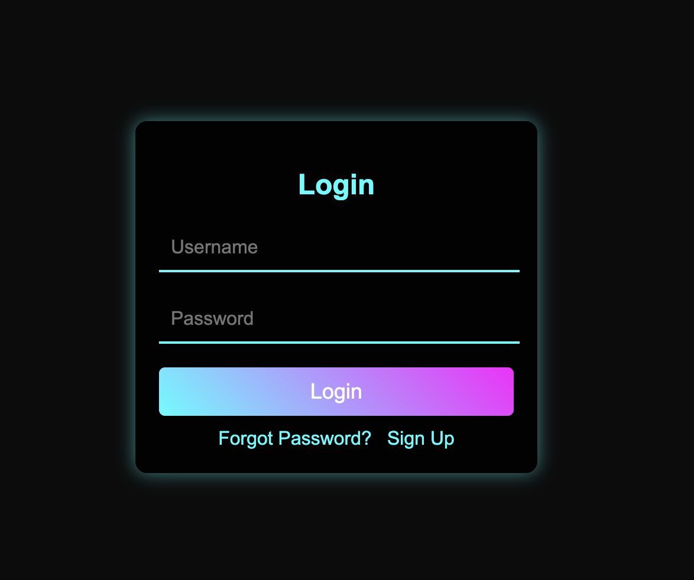

# Day 23 - Glowing Login Form ✨  

## 📝 Description  
In this challenge, we built a **stunning glowing login form** with a futuristic and eye-catching design. This form adds a stylish glow effect to the input fields and buttons, making the user experience more engaging.  

## 🚀 Features  
- **Beautiful glowing effects** for a modern look  
- **Smooth hover and focus animations**  
- **Fully responsive design**  
- **Dark-themed UI for an elegant feel**  


## 🔧 Technologies Used  
- **HTML5**  
- **CSS3 (Neon Glow Effects, Transitions, Shadows)**   

# Demo page

Click [Here](https://ayshasanyang.github.io/Day-23-Glowing-Login-Form/) to view the page

## 🚀 How to Run
1. Download or clone the repository
```bash
git clone https://github.com/ayshasanyang/Day-23-Glowing-Login-Form.git
```
2. Navigate to the project folder.
3. Open the project files in your vscode or any code editor of your choice
4. Open the `index.html` file in your web browser.

---

## 📸 Preview


---
Made with ❤️ by [AYSHA] 🚀